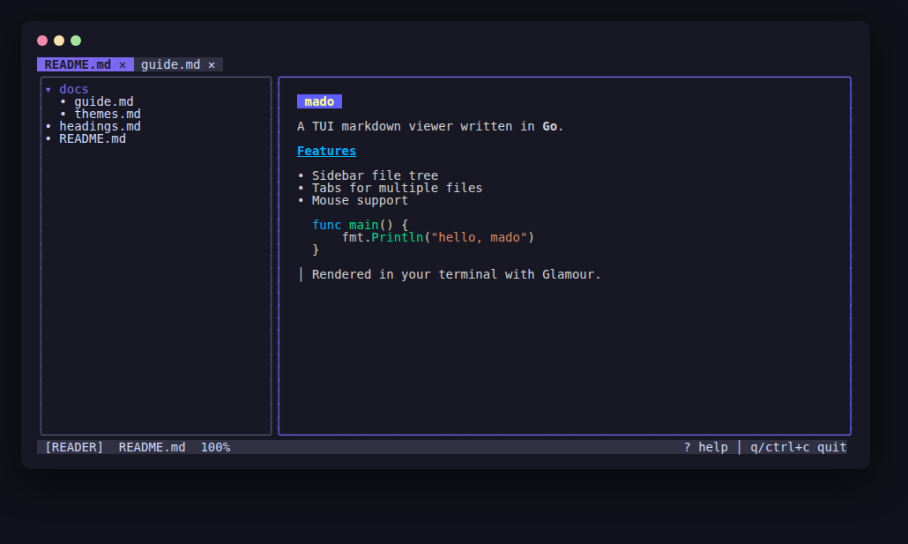
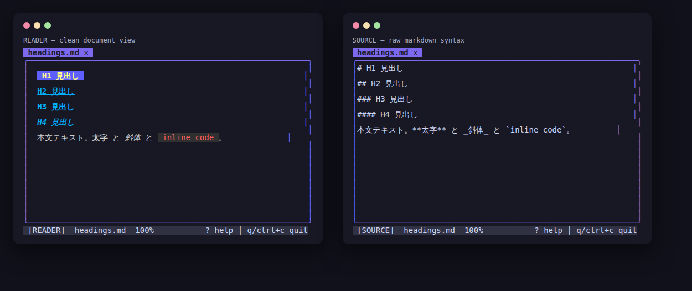

# mado

**mado** (窓, "window") is a TUI markdown viewer written in Go, built on
[Bubble Tea](https://github.com/charmbracelet/bubbletea) and
[Glamour](https://github.com/charmbracelet/glamour).



## Features

- **Markdown rendering** in the terminal via Glamour
- **Reader / source modes** — toggle between a clean document view and syntax-highlighted raw markdown with one key
- **Sidebar file tree** rooted at the current directory (lazy-loaded, collapsible; `a` toggles between markdown-only and all files)
- **Multiple open files** — each file opens in its own tab
- **Mouse support** — click files to open, click tabs to switch, click `✕` to close, scroll wheel in both panes
- **TOML configuration** — `~/.config/mado/config.toml`
- **Configurable keyboard shortcuts** — every action can be rebound
- **Theme customization** — Glamour styles (`auto`, `dark`, `light`, `dracula`, or your own style JSON) plus UI colors and a `source_style` for source-mode highlighting

## Install

Download a prebuilt binary for Linux, macOS, or Windows from the
[releases page](https://github.com/hidekingerz/mado/releases), or
install with Go:

```sh
go install github.com/hidekingerz/mado@latest
```

Or build from source:

```sh
git clone https://github.com/hidekingerz/mado.git
cd mado
go build -o mado .
```

## Usage

```sh
mado                  # browse markdown files under the current directory
mado docs/            # root the sidebar at docs/
mado README.md a.md   # open files in tabs immediately
mado -style dracula   # override the markdown theme
mado -config my.toml  # use an alternate config file
mado -version         # print the version
```

### View modes

There are two ways to look at a file, switched with `m`:

- **Reader** (default) — markdown rendered as a clean document. Heading
  markers (`##`) are hidden; levels are distinguished by color,
  underline, and italics.
- **Source** — the raw markdown text, for checking the syntax itself.



The startup mode can be set with `default_mode = "source"` in the
config.

### Default key bindings

| Key                | Action                          |
| ------------------ | ------------------------------- |
| `↑`/`k`, `↓`/`j`   | move cursor / scroll            |
| `enter`/`l`        | open file / expand directory    |
| `esc`/`h`          | focus the sidebar               |
| `tab`/`]`          | next tab                        |
| `shift+tab`/`[`    | previous tab                    |
| `x`/`ctrl+w`       | close tab                       |
| `b`/`ctrl+b`       | toggle sidebar                  |
| `ctrl+d`/`ctrl+u`  | half page down / up             |
| `g`/`G`            | go to top / bottom              |
| `r`/`F5`           | reload tree and current file    |
| `m`                | toggle reader / source mode     |
| `a`                | show all files / markdown only  |
| `?`                | help                            |
| `q`/`ctrl+c`       | quit                            |

### Mouse

- Click a file in the sidebar to open it; click a directory to expand or collapse it.
- Click a tab to switch to it; click the `✕` on a tab to close it.
- Scroll wheel scrolls whichever pane is under the pointer.

## Configuration

mado reads `$XDG_CONFIG_HOME/mado/config.toml` (default
`~/.config/mado/config.toml`). Every key is optional; unset values fall
back to the defaults. See [`config.example.toml`](config.example.toml)
for the full annotated reference.

```toml
[theme]
style = "dracula"          # glamour style name or path to a style JSON
accent_color = "#7C6AEF"
dir_color = "#89B4FA"      # sidebar directory names
file_color = "#FFFFFF"     # sidebar text files (known binaries are dimmed)

[sidebar]
width = 32
show_all_files = false     # true = list non-markdown files too
show_hidden = false

[keys]
quit = ["q", "ctrl+c"]
open = ["enter", "l"]
next_tab = ["tab", "]"]
# … any action from config.example.toml
```

## License

[Apache-2.0](LICENSE)
